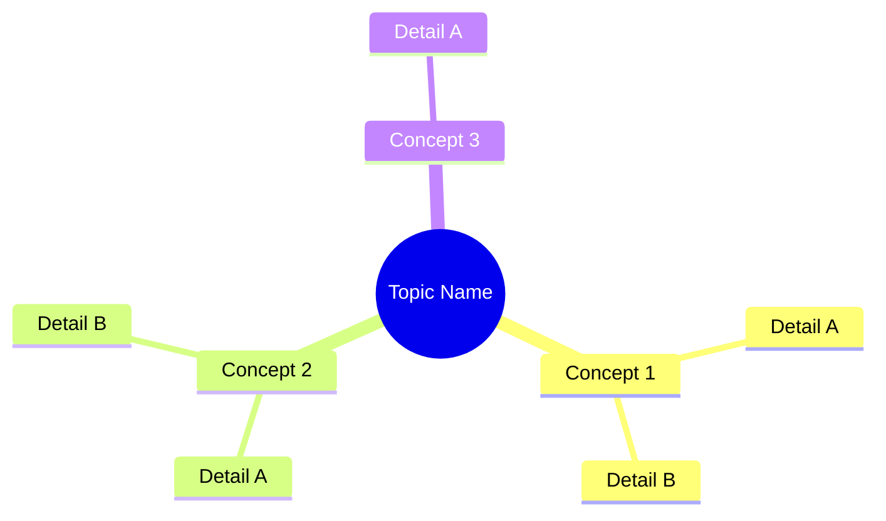

## What This Skill Does

Unified learning and research skill. Auto-detects what you need based on input:

| Input | Mode | What happens |
|---|---|---|
| `/learn brainstorm [topic]` | Brainstorm | Interactive idea generation with pros/cons |
| `/learn lecture.pdf` | File | Extract → YouTube search → NotebookLM → Obsidian note |
| `/learn week3/` | Lecture Pack | Extract all files → YouTube → NotebookLM → Obsidian |
| `/learn "AWS Lambda"` | Topic | YouTube search → NotebookLM → Obsidian note |
| `/learn "AWS Lambda" --file notes.pdf` | Mixed | File + YouTube → NotebookLM → Obsidian |
| `/learn https://...` | URL | Fetch → YouTube → NotebookLM → Obsidian |
| `/learn` + pasted text | Text | Analyse pasted content → structured note |

## Python Executables

- **Python 3.12** (for notebooklm-py): `C:\Users\dnialhziem\AppData\Local\Programs\Python\Python312\python.exe`
- **Python 3.14** (for everything else): `C:\Users\dnialhziem\AppData\Local\Python\bin\python.exe`

---

## Step 1: Parse Input & Detect Mode

Read `$ARGUMENTS` and classify:

| Pattern | Mode |
|---|---|
| Starts with `brainstorm` | **Brainstorm** |
| Ends in `.pdf`, `.pptx`, `.docx`, `.txt` | **File** |
| Is a directory path | **Lecture Pack** |
| Starts with `http` | **URL** |
| Contains `--file` flag | **Mixed** (topic + file) |
| Short keyword/phrase | **Topic** (YouTube-first) |
| Long multi-sentence text | **Text** (direct analysis) |

If no arguments, ask: "What do you want to learn or brainstorm about?"

Check for optional flags:
- `--file [path]` — attach a file source
- `--deliverable [type]` — request study guide, audio overview, or infographic from NotebookLM

---

## Brainstorm Mode

> Triggered by: `/learn brainstorm [topic]`

### B1: Load Past Sessions

Check `C:\Users\dnialhziem\OneDrive\Documents\Obsidian\obsidianvault\brainstorm\` for related summaries. Mention any relevant past sessions found.

### B2: Clarify Before Generating

Ask 2–3 questions to understand context:
- What's the goal or outcome?
- Any constraints (time, resources, scope)?
- Have you already tried approaches? What happened?

**Do NOT generate ideas yet.**

### B3: Generate Ideas (5–7 per round)

For each idea:

```
### [Idea Name]
[2–3 sentence explanation]

**Pros:**
- ...

**Cons:**
- ...
```

### B4: Iterate

Ask which ideas resonate, which to go deeper on, and whether to explore new angles. Keep refining — don't repeat.

### B5: Save Session

When the user wraps up, save to:
`obsidianvault\brainstorm\[topic-slug]-[YYYY-MM-DD].md`

```markdown
# Brainstorm: [Topic]
**Date:** [YYYY-MM-DD]

## Context
[Goal, constraints, background]

## Ideas Explored

### [Idea Name]
[Description]
- **Pros:** ...
- **Cons:** ...
- **Verdict:** [User's reaction]

## Key Insights
- [2–4 bullet points]

## Next Steps
- [Actions the user will pursue]
```

**Then stop.** Brainstorm mode does not use YouTube or NotebookLM.

---

## Learning Mode (File / Lecture Pack / Topic / URL / Mixed / Text)

All non-brainstorm inputs follow this pipeline:

### L1: Extract Content (File/Folder/Text modes only)

Use Python 3.14 for extraction:

**PDF:**
```python
import pdfplumber
with pdfplumber.open("file.pdf") as pdf:
    text = "\n".join(page.extract_text() for page in pdf.pages if page.extract_text())
```

**PPTX:**
```python
from pptx import Presentation
prs = Presentation("file.pptx")
text = "\n".join(
    shape.text for slide in prs.slides
    for shape in slide.shapes if hasattr(shape, "text")
)
```

**DOCX:**
```python
import docx
doc = docx.Document("file.docx")
text = "\n".join(para.text for para in doc.paragraphs if para.text.strip())
```

**Lecture Pack:** Extract all supported files, merge with filename headings.

**Text mode:** Use the pasted text directly.

Save extracted text as a temp `.txt` for NotebookLM upload.

> **Note:** PPTX images are lost — if slides are mostly diagrams, flag this and lean on YouTube as primary source.

### L2: YouTube Search

**Always runs**, regardless of mode. Infer topic from content (first heading, filename, or user input).

```bash
C:\Users\dnialhziem\AppData\Local\Python\bin\python.exe -m yt_dlp "ytsearch5:QUERY" --dump-json --flat-playlist --no-warnings 2>/dev/null
```

Parse each result for: `title`, `webpage_url`, `duration_string`, `view_count`, `uploader`, `description` (first 200 chars).

Present results:
```
## YouTube Results: [query]

1. **[title]** — [uploader] ([duration])
   [URL]

2. ...
```

Ask: "Should I include all of these, or pick specific ones?"

**Wait for confirmation.** NotebookLM costs tokens — don't add unwanted videos.

Prefer: beginner-friendly explanations, visual walkthroughs, official content (AWS, etc.)

### L3: NotebookLM Analysis

Use Python 3.12 for all notebooklm commands:

```bash
set PY12=C:\Users\dnialhziem\AppData\Local\Programs\Python\Python312\python.exe

# Create notebook
%PY12% -m notebooklm create --title "[topic-slug]-[YYYY-MM-DD]"

# Add file content as text source (if applicable)
%PY12% -m notebooklm add-source NOTEBOOK_ID --text "extracted text"

# Add each confirmed YouTube URL
%PY12% -m notebooklm add-source NOTEBOOK_ID --url "https://youtube.com/..."

# Run analysis
%PY12% -m notebooklm chat NOTEBOOK_ID "ANALYSIS_PROMPT"
```

**Analysis prompt** (adapt `[topic]`):
```
Analyse all sources on [topic]. Provide:

## Key Concepts & Definitions
- Main concepts with 1–2 sentence definitions

## Key Takeaways
- 3–5 most important learning points across all sources

## How the Sources Connect
- Where do file content and videos agree or complement each other?
- Gaps in the file that videos fill?

## Application to Year 1 CS / AWS DVA-C02
- Relevance to a Year 1 CS student
- Specific AWS DVA-C02 relevance if applicable

## Summary for Beginners
- Core idea in plain language for someone seeing this topic for the first time
```

If not authenticated, stop: "Run `%PY12% -m notebooklm login` first, then retry."

### L4: Generate Deliverable (if requested)

If `--deliverable` was specified:
- `study-guide`: `%PY12% -m notebooklm study-guide NOTEBOOK_ID`
- `audio-overview`: `%PY12% -m notebooklm audio-overview NOTEBOOK_ID` (~5–10 min)
- `briefing`: `%PY12% -m notebooklm chat NOTEBOOK_ID "Give a concise executive briefing on all sources"`
- `faq`: `%PY12% -m notebooklm chat NOTEBOOK_ID "Generate a FAQ with 10 questions and answers from the sources"`
- `flashcards`: `%PY12% -m notebooklm chat NOTEBOOK_ID "Generate 15 flashcard Q&A pairs for spaced repetition"`
- Other types: use `%PY12% -m notebooklm chat NOTEBOOK_ID "[request]"`

### L5: Generate Mermaid Mindmap

From the analysis, build a mindmap:

````

````

Root topic → 3–5 branches (key concepts) → 2–3 sub-nodes each.

### L6: Save to Obsidian Vault

Output path by mode:

| Mode | Path |
|---|---|
| Lecture Pack | `obsidianvault\uni\[folder-name]\[topic-slug]-[date].md` |
| Topic (YouTube-only) | `obsidianvault\videos\[topic-slug]-[date].md` |
| File / Mixed / URL / Text | `obsidianvault\research\[topic-slug]-[date].md` |

**Note template:**

```markdown
# [Topic] — Learning Notes
**Date:** [YYYY-MM-DD]
**Mode:** [File / Lecture Pack / Topic / URL / Mixed / Text]
**Sources:** [N files + N videos]

---

## Sources

### Files
- [filename] — [brief description]

### Videos
- [Video Title](YouTube URL)

---

## Mind Map

[MERMAID BLOCK]

---

## Key Concepts & Definitions

### [Concept 1]
[Definition]

---

## Key Takeaways

1. ...
2. ...
3. ...

---

## How the Sources Connect

[How file + videos complement each other]

---

## Application to Year 1 CS / AWS DVA-C02

[Relevance]

---

## Summary for Beginners

[Plain-language explanation]

---

## Full Analysis

[Complete NotebookLM output]

## Deliverable

[Study guide / audio overview output, if requested]
```

Tell the user: `Saved to your Obsidian vault at [path]`

---

## Folder Watcher (Passive Trigger)

Background script monitors `obsidianvault\inbox\` and auto-triggers the full learning pipeline when files are dropped in. See [watcher.md](watcher.md) for setup.

**Start:**
```bash
C:\Users\dnialhziem\AppData\Local\Programs\Python\Python312\python.exe scripts\learn-watcher.py
```

---

## Rules

- **Brainstorm mode** never uses YouTube or NotebookLM — it's pure ideation
- **Always search YouTube** in learning mode, even for file inputs — videos fill gaps
- **Always confirm videos** before sending to NotebookLM
- **Always save to vault** — knowledge must accumulate
- **File size limit** — if extracted text exceeds ~50,000 words, split into multiple NotebookLM sources
- **Never make final decisions** in brainstorm mode — present options, user decides
- **5–7 ideas per brainstorm round** — more overwhelms, fewer underwhelms
